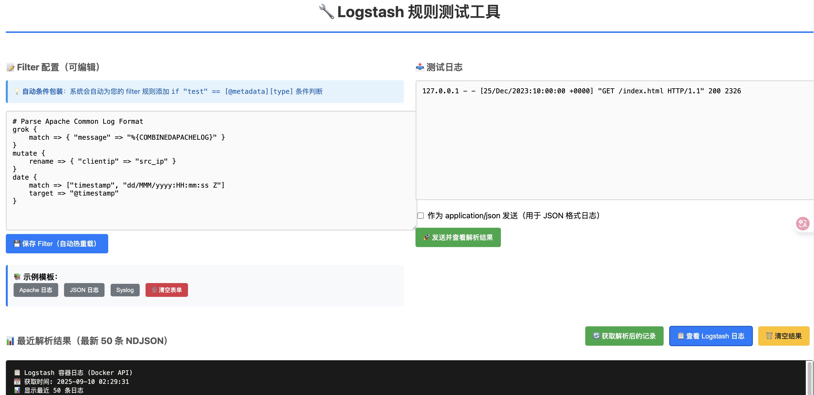

# 🚀 Logstash 规则测试工具

<div align="center">

[](https://github.com/username/logstash-lab/releases)
[](https://docker.com/)
[](LICENSE)

**一个现代化的 Logstash 规则测试和调试工具**

提供直观的 Web 界面，支持实时编辑、测试和调试 Logstash filter 规则

[快速开始](#-快速开始) • [功能演示](#-功能演示) • [使用指南](#-使用指南) • [API 文档](#-api-文档)

</div>

---

## 📸 功能演示

### 主界面概览


### 核心功能
- 🎯 **智能 Filter 编辑器**: 支持语法高亮和自动完成
- ⚡ **实时热重载**: 规则修改 3 秒内自动生效
- 🔍 **解析结果查看**: JSON 格式美化显示，支持一键获取
- 📊 **示例模板库**: 内置常用日志格式模板
- 🔧 **日志调试**: 实时查看 Logstash 运行日志
- 💾 **配置持久化**: 自动保存用户输入，刷新不丢失

## ✨ 核心特性

### 🎯 **智能化 Metadata 管理**
- **自动条件判断替换**: 无论输入任何 `if "xxx" == [@metadata][type]` 条件，自动统一为 `if "test" == [@metadata][type]`
- **元数据自动设置**: 系统自动设置 `[@metadata][type] = "test"`，确保配置一致性
- **简化配置管理**: 用户专注编写 filter 逻辑，无需关心条件判断和元数据匹配

### 🔧 **先进的编辑体验**
- **宽屏自适应布局**: 充分利用屏幕空间，支持大屏显示
- **实时配置验证**: 保存时自动检查 Logstash 配置语法
- **热重载机制**: 配置修改后 3 秒内自动重新加载
- **配置持久化**: 使用 localStorage 保存用户输入，页面刷新不丢失

### 📊 **全面的调试功能**  
- **解析结果实时查看**: 发送日志后立即显示解析结果
- **历史记录获取**: 一键获取最新 50 条解析记录
- **JSON 美化显示**: 格式化输出，易于阅读和分析
- **Logstash 日志查看**: 内置日志查看功能，快速定位问题

### 🚀 **开发友好特性**
- **Docker 化部署**: 一键启动，无需复杂环境配置
- **开发模式支持**: 代码修改自动重载，适合开发调试
- **RESTful API**: 提供完整 API 接口，支持自动化测试
- **跨平台支持**: Linux、macOS、Windows 全平台支持

## 🚀 快速开始

### 系统要求
- Docker 20.0+
- Docker Compose 2.0+
- 可用内存 1GB+

### 一键启动

```bash
# 1. 克隆项目
git clone https://github.com/username/logstash-lab.git
cd logstash-lab

# 2. 启动服务（推荐）
./start.sh

# 或手动启动
sudo docker compose up -d --build
```

### 访问服务

```bash
# Web 界面
http://localhost:19000

# 服务状态检查
sudo docker compose ps
```

## 📖 使用指南

### 基本工作流

1. **📝 编辑 Filter 规则**
   ```logstash
   # 输入您的 filter 规则，支持任何条件判断格式
   filter {
     if "apache" == [@metadata][type] {  # 会自动替换为 "test"
       grok {
         match => { "message" => "%{COMBINEDAPACHELOG}" }
       }
       mutate {
         rename => { "clientip" => "src_ip" }
       }
     }
   }
   ```

2. **💾 保存并自动重载**
   - 点击"保存 Filter"按钮
   - 系统自动重载配置（3秒内生效）
   - 自动设置正确的元数据类型

3. **🧪 输入测试数据**
   ```
   127.0.0.1 - - [25/Dec/2023:10:00:00 +0000] "GET /index.html HTTP/1.1" 200 2326
   ```

4. **🚀 发送并查看结果**
   - 点击"发送并查看解析结果"
   - 实时查看 JSON 格式的解析结果
   - 使用"获取解析后的记录"查看历史记录

### 内置示例模板

| 模板类型 | 描述 | 适用场景 |
|---------|------|----------|
| **Apache 日志** | COMBINEDAPACHELOG 格式 | Web 服务器访问日志 |
| **JSON 日志** | 结构化 JSON 格式 | 应用程序日志 |
| **Syslog** | 标准 syslog 格式 | 系统日志 |
| **自定义格式** | 用户自定义规则 | 特殊格式日志 |

### 高级功能

#### 🔍 **调试和排错**

```bash
# 查看实时日志
sudo docker compose logs -f logstash

# 查看解析结果
tail -f data/out/events.ndjson

# 检查配置语法
sudo docker compose exec logstash bin/logstash --config.test_and_exit
```

#### ⚙️ **自定义配置**

```yaml
# docker-compose.yml 自定义端口
services:
  web:
    ports:
      - "8080:19000"  # 修改 Web 端口
  logstash:
    environment:
      - LS_JAVA_OPTS=-Xms1g -Xmx2g  # 调整内存
```

## 🏗️ 项目架构

```
logstash-lab/
├── 📄 docker-compose.yml          # Docker 服务编排
├── 🚀 start.sh                    # 启动脚本
├── 🌐 web/                        # Web 应用
│   ├── 🐳 Dockerfile              # Web 服务容器
│   ├── 🐍 app.py                  # Flask 后端应用
│   └── 📱 templates/index.html    # 前端界面
├── ⚙️ logstash/                   # Logstash 配置
│   ├── 📝 logstash.yml            # 主配置文件
│   └── 🔧 pipeline/test.conf      # Pipeline 规则
├── 💾 data/out/                   # 输出数据
│   └── 📊 events.ndjson           # 解析结果
└── 📚 docs/                       # 文档和截图
    └── 📸 screenshots/            # 功能截图
```

## 🛠️ 技术栈

| 组件 | 技术选型 | 版本 | 作用 |
|------|----------|------|------|
| **后端框架** | Flask + Waitress | 2.3+ | Web 服务和 API |
| **日志处理** | Logstash | 8.14.2 | 规则解析引擎 |
| **前端技术** | HTML5 + CSS3 + JS | ES6+ | 用户界面 |
| **容器化** | Docker + Compose | 20.0+ | 服务编排 |
| **数据存储** | NDJSON Files | - | 轻量级数据存储 |

## 📋 API 文档

### 核心 API 端点

| 端点 | 方法 | 描述 | 示例 |
|------|------|------|------|
| `/save_filter` | POST | 保存 filter 配置 | `curl -X POST -d "filter=..." localhost:19000/save_filter` |
| `/test` | POST | 发送测试日志 | `curl -X POST -d "logs=test log" localhost:19000/test` |
| `/get_parsed_results` | GET | 获取解析记录 | `curl localhost:19000/get_parsed_results` |
| `/logstash_logs` | GET | 获取 Logstash 日志 | `curl localhost:19000/logstash_logs` |
| `/clear_results` | POST | 清空结果文件 | `curl -X POST localhost:19000/clear_results` |

### API 响应格式

```json
{
  "ok": true,
  "message": "操作成功",
  "data": {...},
  "count": 10
}
```

## 🔧 常用命令

### 服务管理
```bash
# 启动服务
sudo docker compose up -d --build

# 查看服务状态  
sudo docker compose ps

# 重启特定服务
sudo docker compose restart web
sudo docker compose restart logstash

# 停止所有服务
sudo docker compose down
```

### 日志查看
```bash
# 实时查看所有日志
sudo docker compose logs -f

# 查看 Logstash 日志（最近50条）
sudo docker compose logs --tail=50 logstash

# 查看错误日志
sudo docker compose logs logstash | grep -i error

# 监控解析结果
tail -f data/out/events.ndjson | jq .
```

### 开发调试
```bash
# 进入容器调试
sudo docker exec -it logstash-lab-web bash
sudo docker exec -it logstash-lab-logstash bash

# 检查配置语法
sudo docker exec logstash-lab-logstash bin/logstash --config.test_and_exit

# 重新构建镜像
sudo docker compose build --no-cache
```

## 🐛 故障排除

### 常见问题

<details>
<summary><b>📌 Web 界面无法访问</b></summary>

**可能原因：**
- 端口被占用
- 容器启动失败
- 防火墙阻止

**解决方案：**
```bash
# 1. 检查端口占用
lsof -i :19000

# 2. 查看容器状态
sudo docker compose ps

# 3. 查看容器日志
sudo docker compose logs web

# 4. 重新构建
sudo docker compose build --no-cache web
sudo docker compose up -d
```
</details>

<details>
<summary><b>📌 Logstash 启动失败</b></summary>

**可能原因：**
- 内存不足
- 配置语法错误
- 端口冲突

**解决方案：**
```bash
# 1. 检查内存使用
free -h

# 2. 验证配置语法  
sudo docker exec logstash-lab-logstash bin/logstash --config.test_and_exit

# 3. 查看详细日志
sudo docker compose logs --tail=100 logstash

# 4. 调整内存限制
# 编辑 docker-compose.yml 中的 LS_JAVA_OPTS
```
</details>

<details>
<summary><b>📌 Filter 规则不生效</b></summary>

**可能原因：**
- 语法错误
- 条件判断不匹配
- 热重载未完成

**解决方案：**
```bash
# 1. 检查语法错误
sudo docker compose logs --tail=20 logstash | grep -i error

# 2. 等待热重载完成（3-5秒）

# 3. 手动重启 Logstash
sudo docker compose restart logstash

# 4. 使用系统自动处理条件判断
# 输入任何条件，系统会自动替换为 "test"
```
</details>

### 性能优化建议

1. **内存配置**：根据日志量调整 Logstash 内存
2. **磁盘空间**：定期清理 `data/out/events.ndjson`
3. **网络配置**：确保容器间网络通信正常
4. **规则优化**：避免过于复杂的正则表达式

## 🔐 安全注意事项

- ⚠️ **仅限测试环境使用**，不要在生产环境暴露端口
- 🛡️ **不要处理敏感数据**，本工具用于规则测试
- 🔒 **网络隔离**，建议在内网环境使用
- 🔐 **定期更新**，保持 Docker 镜像为最新版本

## 📊 系统要求

| 组件 | 最低配置 | 推荐配置 |
|------|----------|----------|
| **CPU** | 1 核心 | 2+ 核心 |
| **内存** | 1GB | 2GB+ |
| **磁盘** | 2GB | 5GB+ |
| **网络** | 1Mbps | 10Mbps+ |

## 🎯 使用技巧

### 💡 **Filter 规则编写技巧**

1. **从简单开始**：先用基本的 grok 模式测试
2. **逐步添加**：确认基础规则工作后再添加复杂逻辑
3. **使用条件判断**：提高处理效率
4. **善用示例模板**：基于内置模板修改更高效

### 🔍 **调试技巧**

1. **查看原始输出**：使用 stdout 输出查看中间结果
2. **分步测试**：将复杂规则拆分为多个步骤测试
3. **使用 Logstash 日志**：及时查看错误信息
4. **JSON 模式测试**：对于结构化数据使用 JSON 输入模式

### ⚡ **性能优化技巧**

1. **避免过度解析**：只解析需要的字段
2. **合理使用条件**：减少不必要的处理
3. **定期清理数据**：避免输出文件过大
4. **内存监控**：关注 Logstash 内存使用

## 📚 学习资源

- 📖 [Logstash 官方文档](https://www.elastic.co/guide/en/logstash/current/index.html)
- 🔍 [Grok 模式库](https://github.com/elastic/logstash/blob/v1.4.2/patterns/grok-patterns)
- 🔧 [Filter 插件文档](https://www.elastic.co/guide/en/logstash/current/filter-plugins.html)
- 🐍 [Flask 快速入门](https://flask.palletsprojects.com/quickstart/)
- 🐳 [Docker Compose 指南](https://docs.docker.com/compose/)

## 🤝 贡献指南

欢迎提交 Issue 和 Pull Request！

1. Fork 项目
2. 创建功能分支 (`git checkout -b feature/AmazingFeature`)
3. 提交更改 (`git commit -m 'Add some AmazingFeature'`)
4. 推送到分支 (`git push origin feature/AmazingFeature`)
5. 打开 Pull Request

## 📄 许可证

本项目采用 MIT 许可证 - 查看 [LICENSE](LICENSE) 文件了解详情

## 🙏 致谢

- [Elastic](https://www.elastic.co/) - 提供强大的 Logstash 引擎
- [Flask](https://flask.palletsprojects.com/) - 简洁的 Python Web 框架
- [Docker](https://www.docker.com/) - 容器化技术支持

---

<div align="center">

**🎉 开始你的 Logstash 规则测试之旅！**

如果这个项目对你有帮助，请考虑给它一个 ⭐️

[报告问题](https://github.com/username/logstash-lab/issues) • [功能建议](https://github.com/username/logstash-lab/issues) • [加入讨论](https://github.com/username/logstash-lab/discussions)

</div>